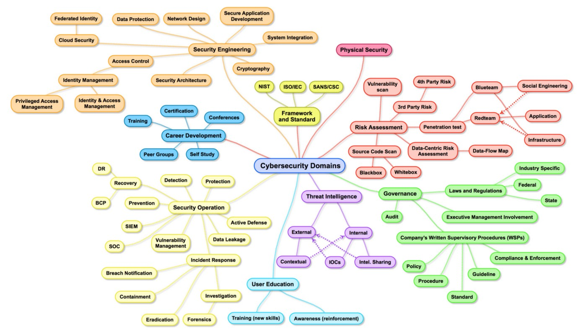

# 1. Introduction

### keywords
```time``` ```cyber security fields``` ```IT security``` ```roadmap``` ```site to follow``` ```blue team``` ```red team``` ```purple team``` ```kali linux``` ```metaspoitable``` ```linux command``` ```python```

## Topics

**Target hour**

200 to 500 is the target hour. We should spent that much time for gaining knowledge about Basic Cyber Security and Career path. 

**Cyber Security Field**

image: Cyber Security Fields

**Cyber Security Opportunities - Home / Abroad**

Search job in Linkedin then you can analysis the ratio of home and aborad job opportunities.


**IT Security vs Cyber Security**

**- What is IT security?**

IT security, also known as information security or InfoSec practically refers to data security. Essential concerns of IT security can be summed up in CIA triad: confidentiality, integrity and availability of the data. In other words, IT security aims to keep an organization’s data safe and reliable. As the broad definition implies, IT security covers a vast area including cyber security. Which means, it is possible to be an IT expert without specializing in cyber security. [1]

**- What is cyber security?**

Similar to IT security, cyber security aims to keep information safe but it especially focuses on the data in digital form: mobile devices, tablets, computers, work stations, servers, networks and such. The purpose of all cyber security practices is keeping electronic data from unauthorized access. In order to do so, cyber security professionals opt for various protocols and methods including the identification of sensitive and/or valuable data, alleviation of vulnerable spots in the security façade of an organization, assessment of risks and much more. [1]


**Cyber Security Team**
1. **Blue Team** (SOC / SEC Analyst) - identifies security threats and risks in the operating environment, and in cooperation with the customer, analyzes the network environment and its current state of security readiness.[2]
2. **Red Team** (Offensive Sec / Pentest) - The role of red teams typically includes pentesting, exploit development, and or web and mobile application pentesting. Additionally, they have been known to explore vulnerabilities or potential angles of attack, finding areas of risk and reporting findings back to the company.[3]
3. **Purple Team** - Purple team members oversee and optimise red and blue teams to establish greater communication channels so they can foster a more collaborative culture.[4]


**Networking knowledge**

**PPT**

The people, process, technology (PPT) framework has been around since the early 1960s. Most businesses used it to improve the operational efficiency of their employees and tools. In the late 1990s, it was popularized in the infosec world by Bruce Schneier. These days, most software companies use the framework for information technology management. [6]

And it’s easy to see why. It helps to map the entire value streams of people, processes, and technology. This helps provide full control and visibility into high-performing teams so they can optimize operations and ship faster.

**CIA Triad**
Confidentiality, integrity and availability, also known as the CIA triad, is a model designed to guide policies for information security within an organization. The model is also sometimes referred to as the AIC triad (availability, integrity and confidentiality) to avoid confusion with the Central Intelligence Agency. Although elements of the triad are three of the most foundational and crucial cybersecurity needs, experts believe the CIA triad needs an upgrade to stay effective.[5]


## Learn
1. Linux command - You can use [Repl](https://replit.com/) for learning purpose.
2. Basic python - [Colac](https://cocalc.com/) is like jupyter notebook online version. You can run python online. 


## Work todo
1. Install Kali linux in Virtual Box with proper settings.
2. Install Metasploitable in Virtual Box. (512mb ram is enough for this )


## Tools and Software
1. Lastpass / Keypass - Password saving software / tool
2. Notion.so - note taking tool
3. Greenshot - screenshot taking tool


## Others


## Links
1. [LastPass](https://www.lastpass.com/)
2. [Notion](https://www.notion.so)
3. [ReplIT](https://replit.com/)
4. [Colac](https://cocalc.com/)
5. [Cybrary.com](https://cybrary.com)
6. [INE - Pentesting](https://my.ine.com/)
7. [TryHackMe.com](https://tryhackme.com/) 


## Reference 
[1] [IT and Cyber security](https://www.logsign.com/blog/it-security-vs-cyber-security-what-is-the-difference/)

[2] [Blue Team](https://csrc.nist.gov/glossary/term/blue_team)

[3] [Red Team](https://ine.com/blog/understanding-red-team-roles)

[4] [Purple Team](https://medium.com/cyberstart-family/red-vs-blue-vs-purple-team-b33d4196f3c0)

[5] [CIA Triad](https://www.techtarget.com/whatis/definition/Confidentiality-integrity-and-availability-CIA)

[6] [PPT](https://www.plutora.com/blog/people-process-technology-ppt-framework-explained)

&nbsp;
&nbsp;
&nbsp;
&nbsp;

[< prev](../README.md) &nbsp; &nbsp; &nbsp; &nbsp; &nbsp; &nbsp; [next >](./2nd-doc.md)

[<< return to index](../README.md)