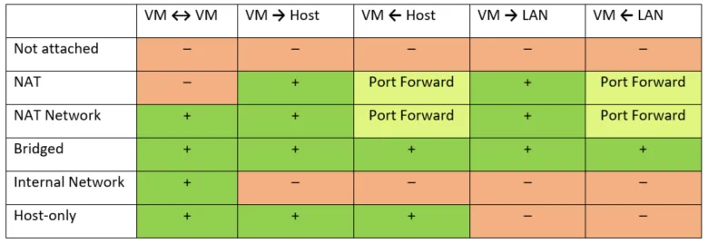
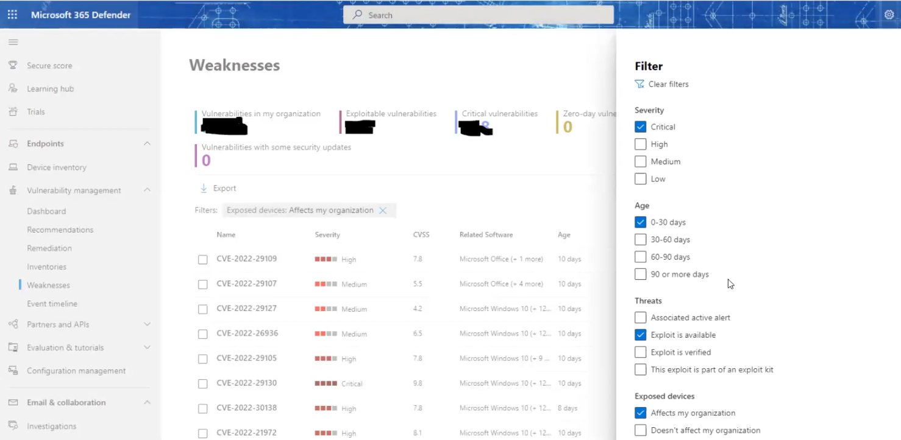

# 2. Risk and Threat

### keywords
```vm``` ```os``` ```kali linux``` ```snapshot``` ```nat``` ```host``` ```bridge``` ```defender 365``` ```severity``` ```assets``` ```risk mitigate``` ```vulnerable``` ```apt attack``` ```security trade off``` ```endpoint``` ```exploit```


## Topic

**Setup VM for your Kali Machine**
1. Tools > Preferences > Install Oracle VM extension pack
2. Tools > Preferences > Network > Add NatNetwork
3. Kali linux vm > Settings > Network > Select Nat Network 
4. Advanced > allow vm (important to ping from host os to guest os)


**Microsoft Defender 365**

Research security related keyword which you will find from Microsoft Defender. Those keywords help you to understand the basic terminology of Basic Cyber Security. 


* Severity level 1, 2, 3, 4 - Hight to Low [Critical, High, Medium, Low]
* According to Assets category Severity Level documentation will be written. **Assets Level** - Platinum, Gold, Silver (Remember asset is a person here but asset could be anything)
* Risk mitigate - When take protective measure is called risk mitigate. (strong password policy, firewall, anti-virus, wifi protection,os update/ patch update)
* Established **Control:** You should not use torrent or crack software. Actually those are control policy. This is the first step for risk mitigate. Also, you need to load balance here or it will be created difficult situation for users.[2]
* Unprotected system are vulnerable and attacker are threat actor. 
* APT Attack: An advanced persistent threat (APT) is a prolonged and targeted cyber attack in which an intruder gains access to a network and remains undetected for an extended period of time.
APT attacks are initiated to steal data rather than cause damage to the target organization's network.[1]
* Zero-day vulnerability: A zero-day vulnerability is a vulnerability in a system or device that has been disclosed but is not yet patched. An exploit that attacks a zero-day vulnerability is called a zero-day exploit.


## Learn
1. Basic Linux command
2. Basic Python practice 
3. Collaborate with team
   
## Work todo

## Tools and Software
1. Kali Linux 
2. Metasploitable 
3. Microsoft Defender 365 

## Others
## Links
1. [ReplIT](https://replit.com/)

## Reference

[1] [APT Attack](https://www.techtarget.com/searchsecurity/definition/advanced-persistent-threat-APT)

[2] [Security Trade off](https://link.springer.com/chapter/10.1007/978-3-642-13678-8_4)

[3] [Zero-day vulnerability](https://www.trendmicro.com/vinfo/us/security/definition/zero-day-vulnerability)

&nbsp;
&nbsp;
&nbsp;
&nbsp;

[< prev](./2nd-doc.md) &nbsp; &nbsp; &nbsp; &nbsp; &nbsp; &nbsp; [next >](./3rd-doc.md)

[<< return to index](../README.md)