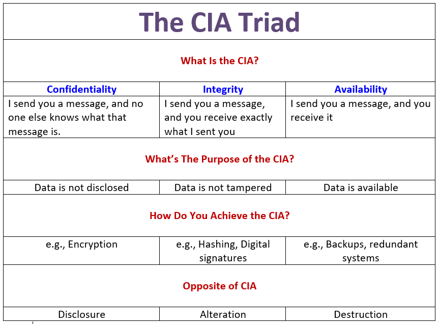

# 3. Hashing and Basic Linux Command

### keywords
```hashing``` ```linux``` ```command``` ```hacking types``` ```method of hacking``` ```hacking tools```

## Topics

**CIA triad**

Search about it for detail infomations. CIA triad is the essential of cyber security.




**Hashing**

Hashing is the practice of using an algorithm to map data of any size to a fixed length. This is called a hash value (or sometimes hash code or hash sums or even a hash digest if you’re feeling fancy). Whereas encryption is a two-way function, hashing is a one-way function. While it’s technically possible to reverse-hash something, the computing power required makes it unfeasible. Hashing is one-way.[1]


**4 Elements of  Security**

1. Confidentiality
2. Integrity
3. Availability
4. Authentication


**Ethical Hacker terminalogy**

* Threat - Lead to a ptential breach of security.
* Exploit - Script or software that can take advantages of a bug.
* Vulnerability - Error or bug that can create security risk.
* Target of Evaulation (TOE) - The subject of a security analysis or attack.
* Remote - Attack without prior access.
* Local,- Need prior access.
* Attack - Attack occurs when system compromised. 


**Common method of Hacking**

* Virus/Trojan - A virus within something.
* Phishing - Replicate logine section.
* Eavesdropping - Monitoring without you knowing.
* Fake wap - Fake wifi to get password.
* DDoSing (Denial of Service) - Flooding traffic to crush your site.   
* Keylogger - That tracks your keypad.
* Social Engineering - Psychological manipulation.
* Bait and Switch - Fake ads with virus.

**Different types of penetration test**
* **What Are The Different Approaches To Penetration Testing?** [2]
- Black Box
- White Box
- Gray Box
* **Types Of  Penetration Testing**
- Network Services
- Web Application
- Client-Side
- Wireless
- Social Engineering
- Physical Penetration Testing

**Many kind of hacking device like USB Rubber Ducky**

You can buy those things from [here](https://shop.hak5.org/)

**Learn some basaic linux command -**

* top
* htop
* chmod
* history
* lsof
* touch, cat, less, vi, file
* ps
* kill
* grep 
* service
* curl
* wget

also learn linux file structure.

## Learn
1. Basic Linux command
2. Linux file system
3. Basic Python practice 
4. Collaborate with team

## What todo

## Tools and Software
1. HashCalc
   
## Others 
1. Atomic habits.
2. Jar of life
3. Project management tools (Trello/Clickup)

## Links

## Reference 
1. [Hashing](https://www.thesslstore.com/blog/difference-encryption-hashing-salting)
2. [Different type pentest](https://purplesec.us/types-penetration-testing/)

&nbsp;
&nbsp;
&nbsp;
&nbsp;

[< prev](./2nd-doc.md) &nbsp; &nbsp; &nbsp; &nbsp; &nbsp; &nbsp; [next >](./4th-doc.md)

[<< return to index](../README.md)