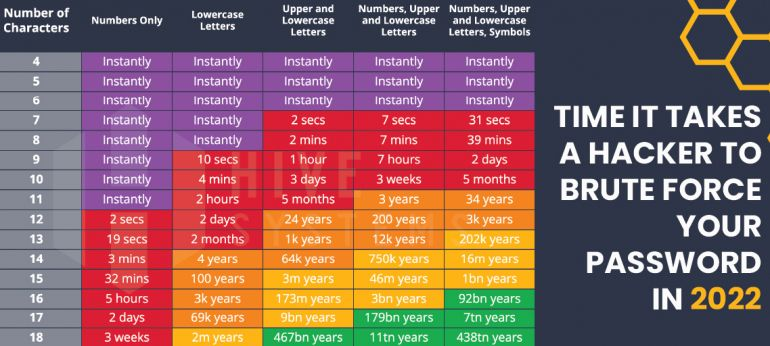

# 8. Passive Recon

### keywords
```SEIM``` ```WAZUH``` ```splunk``` ```google dork```

## Topics

**Linux Basic command**
1. ip a
2. hostname
3. uname -a 
4. whois [url]

**FootPrinting**

There are two types of footprinting in ethical hacking:

1. active footprinting
2. passive footprinting

What is active footprinting?

Active footprinting describes the process of using tools and techniques, like using the traceroute commands or a ping sweep -- Internet Control Message Protocol sweep -- to collect data about a specific target. This often triggers the target's intrusion detection system (IDS). It takes a certain level of stealth and creativity to evade detection successfully.

What is passive footprinting?

As the name implies, passive footprinting involves collecting data about a specific target using innocuous methods, like performing a Google search, looking through Archive.org, using NeoTrace, browsing through employees' social media profiles, looking at job sites and using Whois, a website that provides the domain names and associated networks fora specific organization. It is a stealthier approach to footprinting because it does not trigger the target's IDS.

**WhoIS**

Domain information provider. [Link 1]

**CRT**

Enter an Identity (Domain Name, Organization Name, etc),
a Certificate Fingerprint (SHA-1 or SHA-256) or a crt.sh ID. [Link 2]

**Hunter.IO**

The Domain Search provides a list of the people working in a company with their name and email address, all found on the web. With 100+ million email addresses indexed, effective search filters and deliverability checks, it's Hunter's most powerful email-finding tool. [Link 3]

**IntelX.IO**

Where exposes your email. It will find for you.

**User name checker :** You will find many username checker web app in online.

**Strong password hacking time**


**Pentesting Scope**


## Learn
1. Google Dork


## Others
**Alison :** Free Online Courses With Certificates & Diplomas.[Link 5]

**Comptia :** Start or grow your career in IT with an IT certification from CompTIA. Find everything you need to get certified. [Link 6]

**Splunk Trainin :** Splunk Training + Certification.[Link 7]


## Links
1. [WhoIS](https://www.whois.com/)
2. [CRT](https://crt.sh/)
3. [Hunter.IO](https://hunter.io/)
4. [IntelX.IO](https://intelx.io/)
5. [Alison](https://alison.com/)
6. [Comptia](https://www.comptia.org/home)
7. [Splunk Training](https://www.splunk.com/en_us/training.html?sort=Newest)

## Reference 
1. [Foot Printing](https://www.techtarget.com/searchsecurity/definition/footprinting)